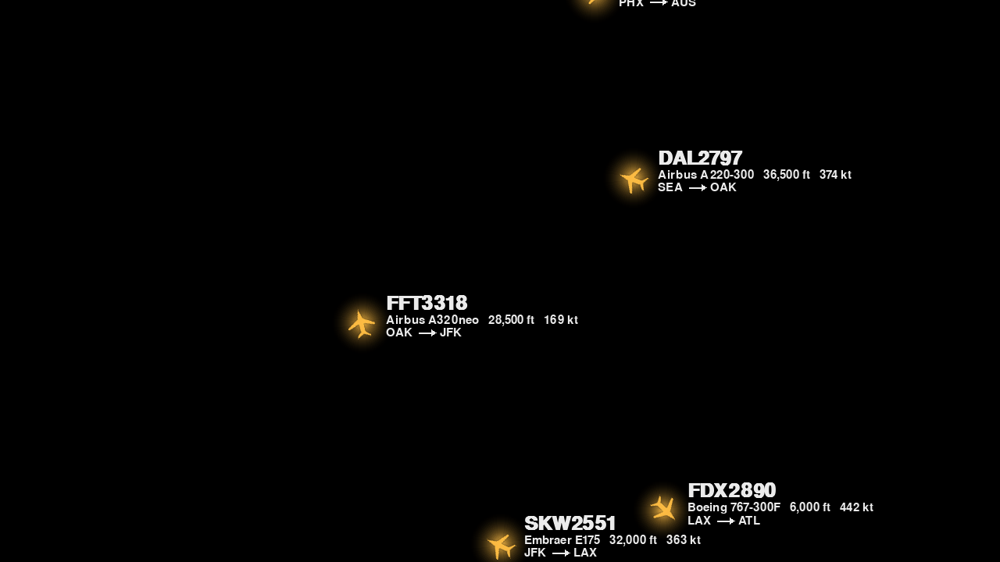
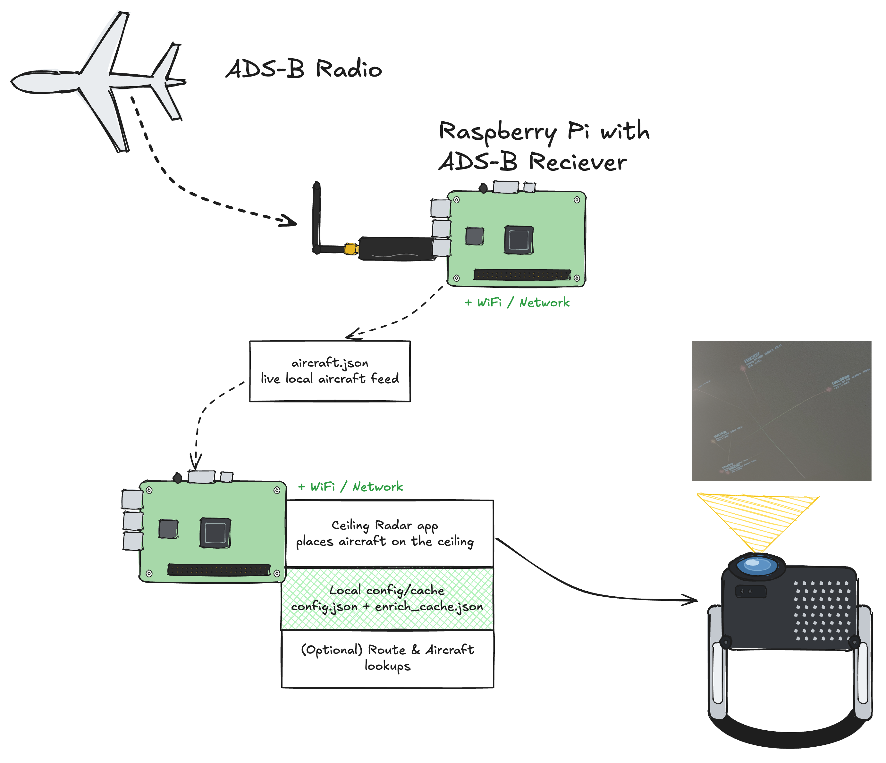

# Ceiling Radar

Projects live aircraft from an **ADS-B JSON feed** onto your **ceiling** as glowing
sprites with fading trails and floating telemetry — on a pure-black background so a
projector emits no light there and only the planes and text appear, like a heads-up
display painted onto the room.

Built for a **Raspberry Pi 5 + HDMI projector**, but it runs on any computer with
Python. No receiver? It ships with a **demo mode** of simulated traffic so you can
build, calibrate, and admire it before pointing it at real data.



---

## Quickstart

Three commands from a clean checkout to a window full of simulated planes:

```bash
curl -LsSf https://astral.sh/uv/install.sh | sh   # one-time: install uv
source $HOME/.local/bin/env
uv sync                                           # create .venv from uv.lock

#`uv sync` is reproducible across machines — the same `uv.lock` resolves to the same
# versions on your laptop and on the Pi.

uv run ceiling_radar.py --demo --windowed         # simulated traffic, no receiver
```

That's it. The default config starts in demo mode and uses neutral coordinates.
When you have a real feed, copy `config.example.json` to `config.json`, edit
`home.lat/lon`, `feed.url`, and `feed.demo`, then run `uv run ceiling_radar.py`.

---

## Why it looks like the photo (and not a flight-radar website)

- **Black = invisible.** A projector projects black as *no light*. The whole frame
  is black except the planes, so the ceiling texture shows through and only the
  bright elements glow. There is no "background" to remove — there never is one.
- **Custom minimal renderer**, not the dump1090/tar1090 web GUI. No map tiles, no
  panels, no chrome. Just glow + silhouette + trail + label.
- **Additive glow** for the luminous amber look, **comet-fade trails**, and a clean
  label (callsign bold, then type / altitude / speed, then route with a drawn arrow).

---

## Hardware



| Part | Notes |
|---|---|
| Raspberry Pi 5 (Pi 4 also fine) | Runs the renderer |
| HDMI projector | Point it at the ceiling. Short-throw helps. Brightness matters in lit rooms. |
| ADS-B receiver (optional) | Any dump1090 / dump1090-mutability / readsb feeder. Or use demo mode. |

Works with **any projector and any resolution** — set `display.width/height` (or pass
`--width/--height`). The projection geometry is corrected in software, so the
projector does not need to be square to the ceiling.

---

## Setup


Then from the project folder:

```bash                              # creates .venv, pulls deps from uv.lock
cp config.example.json config.json       # then edit config.json (see below)
```

> then edit config.json (see below)

---

## Run

```bash
uv run ceiling_radar.py                  # use config.json
uv run ceiling_radar.py --demo           # simulated traffic, no receiver needed
uv run ceiling_radar.py --windowed       # not fullscreen (handy while setting up)
```

Or use the installed console script:

```bash
uv run ceiling-radar --demo --windowed
```

First time, try `--demo --windowed` to confirm it renders, then switch to your feed.

---

## Demo mode & testing (no receiver needed)

The app ships with **simulated traffic** so anyone can build, calibrate, and admire it
with zero hardware. Demo planes have realistic callsigns, types, and routes so the
labels look exactly like the real thing.

```bash
uv run ceiling_radar.py --demo --windowed     # watch simulated traffic in a window
```

Or toggle it live with the **`d`** key while running. And if your real feed is ever
unreachable, `feed.fallback_to_demo` (on by default) shows demo traffic instead of a
blank ceiling, so you always see *something*.

**Self-checks and headless runs** (no display required — handy on a fresh Pi or in CI):

```bash
uv run ceiling_radar.py --selftest            # verify the geometry + route parsing
SDL_VIDEODRIVER=dummy uv run ceiling_radar.py --demo --frames 120   # 120 frames, no screen
```

`--selftest` checks the homography (identity + keystone corners), the geo→metres
conversion, and route formatting, then exits. `--frames N` runs the full pipeline for
N frames and exits — a quick smoke test that everything wires together.

To sanity-check your **real feed** before projecting anything:

```bash
curl -s http://receiver.local/dump1090/data/aircraft.json | head -c 400
```

If that returns JSON with an `aircraft` array, the app will read it.

---

## Configure (`config.json`)

The most important fields:

| Field | Meaning |
|---|---|
| `feed.url` | Your dump1090 aircraft JSON, e.g. `http://receiver.local/dump1090/data/aircraft.json` |
| `feed.fallback_to_demo` | If the feed can't be reached, fall back to demo instead of a blank screen |
| `home.lat`, `home.lon` | **Your receiver's location.** Everything is positioned relative to this. Set it. |
| `view.range_m` | Metres from screen centre to the short edge — how much sky fits on the ceiling |
| `view.north_deg` | Rotate the whole view so map-north points wherever you want in the room |
| `view.flip_x` | Mirror the projection horizontally. Default is `true` for ceiling projection; press `x` to toggle |
| `config.write_on_start` / `config.autosave` | Write merged defaults on launch and save calibration changes automatically |
| `lookout.*` | Optional "LOOK FRONT/BACK/LEFT/RIGHT" cue for nearby, low aircraft |
| `distance_color.*` | Optional green/yellow/red plane color by distance from HOME |
| `display.*` | Resolution / fullscreen / fps for your projector |
| `keystone.corners` | The 4 output corners for skew correction (set via calibration; `null` = full frame) |
| `enrich.routes` / `enrich.types` | Fetch origin→destination (on) and aircraft type (off) from free APIs. See below. |
| `style.*` | Colours, glow, trail length, icon and label size, optional font |

**Better-looking labels:** drop an `Inter`, `Barlow`, or `Roboto Condensed` `.ttf`
into the folder and set `style.font_path` to its filename. The default font works
fine, but a condensed sans matches the photo more closely.

---

## Calibration — get the projection square and the planes where they belong

This is the part that makes a tilted projector look perfect. Press **`c`** to enter
calibration mode. It uses a **homography** (a 3×3 projective transform), which exactly
models a flat surface viewed from any angle — so **4 corner points fully correct
keystone, skew, rotation, and scale at once.**

Two layers, both saved to `config.json` automatically by default. Press **`s`**
any time to force a save.

**1. Keystone (the skew fix).** A green outline shows your output quad with 4 handles.

- `1` `2` `3` `4` select a corner (TL, TR, BR, BL)
- arrow keys nudge it (hold **Shift** for ×10 steps)
- drag the corners until the projected rectangle sits square on the ceiling
- `r` resets the corners to the full frame

**2. Placement (where the sky lands).**

Calibration mode now draws a big high-contrast compass and range map on the
ceiling. The orange **HOME** bullseye is your configured receiver/home position.
The distance rings show the radius from home, and the top-left readout shows
radius, diameter, and approximate covered area. The fat red triangle and **N**
label show true map-north after rotation, mirroring, and keystone are applied.

- `[` / `]` — zoom the view out / in (`range_m`, the radius from HOME)
- `,` / `.` — rotate the view (`north_deg`); aim the red north triangle at true north
- `;` / `'` — rotate the FRONT/BACK yard axis (`lookout.front_yard_deg`)
- `x` — flip horizontally. The default is mirrored for ceiling projection, but you
  can flip back any time.
- `l` — toggle the lookout cue on/off

**Ground-truth tune:** watch a plane you can actually see out the window — when it's
visually to your south-west, it should sit south-west on the ceiling. Nudge `range_m`
and `north_deg` until a real aircraft lands where it physically is.

**Lookout cue:** press `c` and rotate the FRONT/BACK yard axis with `;` / `'`
until FRONT points toward your actual front yard. That writes
`lookout.front_yard_deg` to `config.json`. When an aircraft is within
`lookout.near_radius_m` and below `lookout.max_altitude_ft`, the label adds
`LOOK FRONT`, `LOOK BACK`, `LOOK LEFT`, or `LOOK RIGHT`. Set
`lookout.enabled: false` or press `l` to disable it. Altitude is ADS-B/barometric
altitude, not exact height above your roof.

**Lookout distance ballparks:** a plane at 5,000 ft is technically visible from
much farther away in clear sky, but it gets low on the horizon quickly. The cue is
meant to answer "should I step outside now?", not "is it theoretically visible?"

| Horizontal distance | Elevation angle at 5,000 ft | Practical feel |
|---|---:|---|
| 1 mi | about 43 deg up | very close / easy to spot |
| 2 mi | about 25 deg up | good default for LOOK cue |
| 3 mi | about 18 deg up | still useful, wider alert |
| 4.6 mi | about 12 deg up | visible in clear sky, but low |
| 8 mi | about 7 deg up | horizon-ish; easy to miss behind trees/houses |

Start with `lookout.near_radius_m: 3200` (about 2 mi) and
`lookout.max_altitude_ft: 6000`. If you have an open backyard view, try 4800 m
(about 3 mi). A 4.6 mi outer cue is reasonable for "possibly visible", but it may
fire too often for "go look right now."

**Distance color:** normal running can color aircraft by distance from HOME using
the current map radius. Green means close to the center/home, yellow means middle
distance, and red means near the edge of the current view. This is softer than the
LOOK cue: a red or orange aircraft may still be visible from the yard even if it
is not close enough to trigger `LOOK BACK`. Disable it with:

```json
"distance_color": {
  "enabled": false
}
```

> A flat ceiling needs only the 4 corners. If your ceiling is vaulted or curved,
> the homography won't be perfect everywhere — that would need a multi-point mesh
> warp, a sensible future upgrade.

### All keys

| Key | Action |
|---|---|
| `c` | toggle calibration overlay |
| `1`–`4` / arrows | select / nudge keystone corner (Shift = ×10) |
| `[` `]` | range out / in |
| `,` `.` | rotate north |
| `;` `'` | rotate FRONT/BACK yard axis |
| `x` | flip horizontally |
| `l` | toggle lookout cue |
| `r` | reset keystone |
| `s` | force-save config |
| `d` | toggle demo mode |
| `f` | toggle fullscreen |
| `q` / `Esc` | quit |

---

## The label: callsign, type, altitude, speed, route

Raw ADS-B (and your `dump1090-mutability` feed) gives callsign, altitude, speed, and
position directly. **Aircraft type and route are NOT transmitted by ADS-B** — they're
fused in from free APIs. Both need internet; if you're offline the label just shows
what the feed has. Calibration mode shows a small enrichment status after the feed
status. Successful lookups are cached to `enrich_cache.json`.

**Route (e.g. `DEN → OAK`) — on by default.** First tries the **adsb.lol routeset
API** (`https://api.adsb.lol/api/0/routeset`) with one batched POST of `{callsign,
lat, lng}`. If that returns no row, it falls back to **adsbdb** per callsign
(`https://api.adsbdb.com/v0/callsign/`). Polite by default (`enrich.min_interval`
seconds between requests). Set `enrich.routes: false` to disable.

Route lookups are treated as untrusted until the aircraft's current position and
altitude are plausible for that origin/destination. This is intentionally
conservative: if a low aircraft is nowhere near either airport, the app rejects
the route and leaves the route label blank. That avoids stale/reused callsign
mistakes such as showing a long-haul or wrong-city route for an aircraft that is
clearly low and local.

```bash
# what the app sends, by hand:
curl -X POST 'https://api.adsb.lol/api/0/routeset' \
  -H 'Content-Type: application/json' \
  -d '{"planes":[{"callsign":"ABC123","lat":0.1,"lng":0.1}]}'
```

**Type (e.g. `Boeing 737-8`) — off by default.** Tries the **adsb.fi** per-hex
endpoint (`/v2/hex/<hex>`, no key), then falls back to **adsbdb** per aircraft
(`https://api.adsbdb.com/v0/aircraft/<hex>`). It's one request per new aircraft,
so it's off unless you set `enrich.types: true`.

**Other route sources** if you outgrow routeset:

| Source | Key? | Notes |
|---|---|---|
| **adsb.lol routeset** (default) | no | Free, batched, live, no account. Best default. |
| **FlightAware AeroAPI** | yes | Official; pay-as-you-go, but feeders get a small free monthly credit. Most authoritative. |
| **FlightRadar24 API** | yes | Official paid API with a limited free tier. (The old scraped `data-live.flightradar24.com` endpoints violate their terms and break — avoid.) |
| **OpenSky Network** | free acct | `/flights/aircraft` gives *observed* departure/arrival by hex over a time window — good for tail history. |

Avoid scraping Google or the tracker websites directly — it's flaky and against their
terms. The routeset API returns the same answer cleanly.

For best route accuracy, use an official flight-status API that can identify a
specific active flight, not just a reused callsign. FlightAware AeroAPI and the
official Flightradar24 API are better candidates than free callsign lookups, but
they require accounts/API keys. Without that, Ceiling Radar prefers no route over
a wrong route.

---

## Autostart on Raspberry Pi 5

Shortest reliable setup: run it as your Pi user with a systemd user service. This
starts on boot, restarts after crashes, and keeps working without SSH.

From the project folder on the Pi:

```bash
mkdir -p ~/.config/systemd/user
cat > ~/.config/systemd/user/ceiling-radar.service <<'EOF'
[Unit]
Description=Ceiling Radar
After=graphical-session.target

[Service]
WorkingDirectory=%h/plane-demo
Environment=WAYLAND_DISPLAY=wayland-0
Environment=SDL_VIDEODRIVER=wayland
ExecStartPre=/bin/sh -c 'for i in $(seq 1 60); do [ -S "$XDG_RUNTIME_DIR/wayland-0" ] && exit 0; sleep 1; done; exit 1'
ExecStart=%h/.local/bin/uv run --project %h/plane-demo ceiling_radar.py --config %h/plane-demo/config.json
Restart=always
RestartSec=3

[Install]
WantedBy=default.target
EOF

systemctl --user daemon-reload
systemctl --user enable --now ceiling-radar
sudo loginctl enable-linger "$USER"
journalctl --user -u ceiling-radar -f
```

Adjust `WorkingDirectory` and `ExecStart` if your checkout is somewhere other than
`~/plane-demo`. The Wayland lines make the fullscreen window attach to the Pi
desktop after reboot, and `enable-linger` is the piece that makes the user service
start even before you SSH in.

Useful commands:

```bash
systemctl --user restart ceiling-radar
systemctl --user status ceiling-radar
journalctl --user -u ceiling-radar -n 80
```

---

## Troubleshooting

- **Blank ceiling / black screen:** check `feed.url` is reachable
  (`curl <url>`), or run `--demo` to confirm rendering works. With
  `fallback_to_demo: true` a dead feed shows demo traffic, not nothing.
- **Planes in the wrong place / mirrored:** set `home.lat/lon`, then calibrate
  `north_deg` and `flip_x`.
- **Image is a skewed trapezoid:** that's what keystone calibration fixes — press `c`.
- **Route shows nothing:** routes need internet (the adsb.lol lookup). Check you're
  online and `enrich.routes` is `true`; unscheduled/military flights often have no
  known route. Type only appears if you set `enrich.types: true`.
- **`SDL` / display errors over SSH:** run on the Pi's own display, or set the right
  `SDL_VIDEODRIVER` (`kmsdrm` for console, or run inside the desktop session).

---

## How it works (pipeline)

```
aircraft.json  ->  parse (dump1090 fields)  ->  dead-reckon + smooth
   ->  geo (lat/lon)  ->  local metres (ENU about home)
   ->  ideal canvas (rotate/scale/centre)  ->  homography (keystone)  ->  pixels
   ->  draw glow + heading-rotated silhouette + comet trail + label  ->  projector
```

Feed polling runs on a background thread; rendering dead-reckons each aircraft from
its last fix (`position + speed·track·Δt`) and eases the drawn position toward it, so
planes glide smoothly at 60 fps even though ADS-B updates ~once per second.

### Dependencies

Deliberately light: `pygame`, `numpy`, `requests`. The homography is solved with
NumPy — no OpenCV needed. The pinned set lives in `pyproject.toml` and `uv.lock`.
