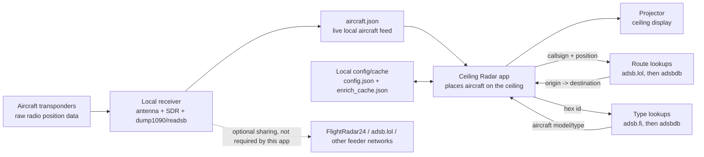

# Ceiling Radar Data Sources

This project combines one local live aircraft feed with a few optional internet
lookups. The local feed is the source of truth for where aircraft are. Internet
lookups only add labels like route and aircraft type.

## What Comes From Where

| Data | Comes From | Why It Is Used |
|---|---|
| Aircraft position | Local ADS-B receiver via `aircraft.json` | Puts each aircraft in the correct place over your home. This is the main data source. |
| Callsign | Local ADS-B receiver via `aircraft.json` | Labels the plane and gives route APIs something to search. |
| Altitude, speed, track | Local ADS-B receiver via `aircraft.json` | Draws useful labels, heading, motion smoothing, and trails. |
| Route, such as `DEN -> OAK` | `adsb.lol` routeset first, then `adsbdb` callsign fallback | ADS-B does not broadcast origin/destination, so this is supplemental. |
| Aircraft type, such as `Boeing 737-8` | `adsb.fi` hex lookup first, then `adsbdb` aircraft fallback | Raw local feeds often do not include model/type, so this is supplemental. |
| Home location, north, zoom, flip, keystone | `config.json` | Tells the app how to map real aircraft positions onto your ceiling. |
| Cached route/type answers | `enrich_cache.json` | Avoids asking public APIs for the same information over and over. |
| Final picture | Ceiling Radar renderer over HDMI | Shows the black-background aircraft projection on the ceiling. |

## Important Notes

- The app does not need FlightRadar24 to display planes. FR24 is only an optional
  feeder/network that the receiver may also send data to.
- If the internet is offline, the app can still show local aircraft positions.
  It may just omit route/type labels.
- If the local ADS-B receiver is offline, there is no live position source. With
  `feed.fallback_to_demo` enabled, the app shows simulated demo traffic instead.
